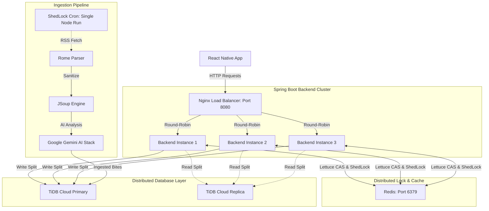

<div align="center">
  
  <h1>TechBite</h1>
  <p><b>Master High-Yield Tech News in 2 Minutes a Day.</b></p>
  <p><i>A mobile-first, AI-powered short news app designed for Computer Science students and software engineers.</i></p>

  [](#)
  [](#)
  [](#)
  [](#)
  [](#)
</div>

---

## 📖 Overview

**TechBite** solves the "information overload" problem for tech professionals and students. Instead of scrolling through endless articles, TechBite automatically scrapes top tech blogs, uses **Google Gemini AI** to summarize them into 80-150 word "bites", and delivers them in a highly addictive, frictionless vertical feed (similar to TikTok/Shorts).

Engineered as a **production-grade distributed system**, TechBite is capable of high-concurrency traffic through horizontal scaling, database read/write splitting, dynamic Redis CAS rate-limiting, and distributed locking synchronization.

---

## ✨ Features

- **⚡ 60 FPS Vertical Feed**: Hyper-optimized native scrolling using Shopify's `FlashList` and Reanimated.
- **🤖 AI Ingestion Pipeline**: Automated background ingestion pipeline utilizing Gemini AI with full multi-model API redundancy to extract key insights.
- **🔒 Distributed Task Synchronization**: Leverages **ShedLock** with a Redis lock provider to ensure exactly one replica executes scheduled news scraping jobs in a clustered environment.
- **🛡️ Cluster-Wide CAS Rate Limiting**: Built on **Bucket4j + Lettuce Redis CAS**, utilizing Lettuce's atomic CAS provider over a shared `RedisConnectionFactory` to block high-volume traffic across all replicas instantly.
- **🧠 Personalized "For You"**: Tailored content delivery based on user-selected interests (DSA, AI, Web Dev, etc.).
- **🔥 Daily Streaks & Gamification**: Push notifications and streak tracking to build consistent learning habits.
- **🔖 Bookmarks & Social Sharing**: Save crucial interview prep tips or share dynamic deep links that redirect directly into the app.
- **🔐 Secure Stateless Auth**: Seamless Google Sign-In backed by Firebase Admin SDK, custom user roles (`USER` / `ADMIN`), and stateless JWT verification.

---

## 🛠️ Tech Stack

| Domain | Technologies Used |
| :--- | :--- |
| **Mobile Client** | React Native (Expo), TypeScript, FlashList, Reanimated, React Query, NativeWind (Tailwind) |
| **Backend API** | Java 17, Spring Boot 3.2, Spring Security, Spring AI, Rome (RSS), Bucket4j, ShedLock |
| **Database & Cache** | TiDB Cloud (MySQL Dialect), Redis (Lettuce Client) |
| **DevOps & Cloud** | Docker, Nginx (Round-Robin Load Balancer), Render (PaaS), EAS (Expo Application Services) |

---

## 🏗️ Architecture & Production Highlights

This project moves beyond standard CRUD apps by implementing **Enterprise-grade distributed patterns**:

### 1. High-Availability Clustered Scale-Out
- **Stateless JVM Architecture**: Session states are managed exclusively via JWTs. An **Nginx Load Balancer** distributes traffic using a Round-Robin algorithm across a scaling cluster of Spring Boot nodes.
- **TiDB Read/Write Splitting**: Implemented custom `AbstractRoutingDataSource` and Spring AOP to route heavy feed queries to TiDB Read Replicas (`tidb_replica_read = 'leader-and-follower'`), prioritizing system availability (CAP Theorem AP-Mode).

### 2. Distributed Lock Coordination (ShedLock)
To prevent scraping redundancy, resource conflicts, and API quota waste across a 3-replica backend cluster, TechBite implements **ShedLock** using Redis as the lock provider:
```java
@Scheduled(cron = "0 0 */2 * * *")
@SchedulerLock(
    name = "NewsIngestion_scheduledIngest", 
    lockAtMostFor = "15m", 
    lockAtLeastFor = "5m"
)
public void scheduledIngest() { ... }
```
When the cron triggers, instances compete for the `NewsIngestion_scheduledIngest` lock stored inside the shared Redis space. The winning instance executes the ingestion job, while other replicas skip the run safely.

### 3. Shared CAS API Throttling
Unlike traditional rate limiters which track requests in JVM memory (failing in distributed clusters), TechBite uses a **distributed, lock-free rate limiting** mechanism based on **Bucket4j + Lettuce Redis CAS (Compare-and-Swap)**:
- **Shared Connection Pooling**: Reuses Spring's primary `RedisConnectionFactory` connection pool to eliminate Lettuce socket overhead and potential connection leaks.
- **Atomic Operations**: Employs Letuce's CAS provider (`LettuceBasedProxyManager`) to dynamically query and update keys (`GUEST_172.x.x.x` or `AUTH_<UID>`) atomically, guaranteeing precise rate limit enforcement across all replica nodes without network bottlenecking.
- **Capacities**: Permitted 60 requests/min for guests, and 200 requests/min for authenticated accounts.

### 4. Resilient Multi-Model AI Stack
- A scheduled Spring Boot cron job reads RSS feeds via **Rome**.
- Raw HTML is sanitized using **JSoup** to prevent prompt injection.
- AI summaries utilize a robust, cascading **4-model fallback stack** (`gemini-2.5-flash` $\rightarrow$ `gemini-3.1-flash-lite-preview` $\rightarrow$ `gemini-3-flash-preview` $\rightarrow$ `gemini-2.5-flash-lite`) with automatic exponential rate-limit back-offs, securing 100% aggregation SLA.

---

## 📊 System Architecture Flow



---

## 📸 Screenshots

<div align="center">
  <!-- Note: Update image paths with actual deployed screenshots later -->
  
  
  
  
</div>

---

## 🚀 Quick Start

### Prerequisites
- Node.js (v18+) & Java (JDK 17)
- Docker Desktop
- Firebase Project & Google Gemini API Key

### 1. Run the Multi-Replica Backend Locally (Docker Compose)
The backend is fully containerized for a zero-config setup.
```bash
cd backend
# 1. Copy .env.example to .env and configure DATABASE_WRITER_URL, GEMINI_API_KEY, and Firebase credentials
# 2. Boot up the entire high-availability cluster
docker compose up -d --scale backend=3 --build
```
*This starts a local TiDB/MySQL compatible server, Redis, 3 Spring Boot backend instances, and the Nginx Load Balancer routing on `localhost:8080`.*

### 2. Run the Mobile App
```bash
cd mobile
npm install
# Rename .env.example to .env and set EXPO_PUBLIC_API_URL=http://<YOUR_IP>:8080/api/v1
npx expo start
```
*Use the Expo Go app on your physical iOS/Android device or boot up an Emulator to run the application.*

---

## 🎯 Resume & Interview Talking Points

If you are an interviewer or technical recruiter reviewing this project, here are the key engineering challenges solved:

* **Distributed Coordination & ShedLock**: Solved data ingestion concurrency by implementing ShedLock distributed locks using Redis as the lock provider, ensuring only one replica in a 3-instance Spring Boot cluster executes heavy scraping routines.
* **Distributed CAS Throttling**: Designed a cluster-wide lock-free rate limiter with Bucket4j + Lettuce Redis CAS, extracting the connection pool directly from Spring Data's `RedisConnectionFactory` to guarantee strict throttling safety across replicas.
* **Database Routing & TiDB Tuning**: Configured a custom AbstractRoutingDataSource with Spring AOP to split Read/Write SQL operations, leveraging TiDB Follower Reads to achieve high availability (CAP AP-mode). Resolved critical TiDB driver setReadOnly propagation syntax errors globally.
* **Hermes & Gradle Optimization**: Achieved a sub-30MB production APK by configuring Android ABI Splitting and the Hermes engine in React Native, leading to a 75% reduction in binary footprint.
* **API Resiliency with Fallbacks**: Built a redundant, fail-safe AI pipeline utilizing a 4-model Gemini API fallback system with smart back-offs and exponential rate-limit delays to guarantee a 100% ingestion uptime SLA on free-tier limits.
* **Secured Architecture & Dynamic RBAC**: Eliminated client-side administration whitelists by implementing dynamic user role properties (`USER` / `ADMIN`) returned via secure Firebase authentication filters and restricted CORS configurations to strict subnets and explicit origins.

---

<div align="center">
  <i>Made with ❤️ by developers, for developers.</i>
</div>
